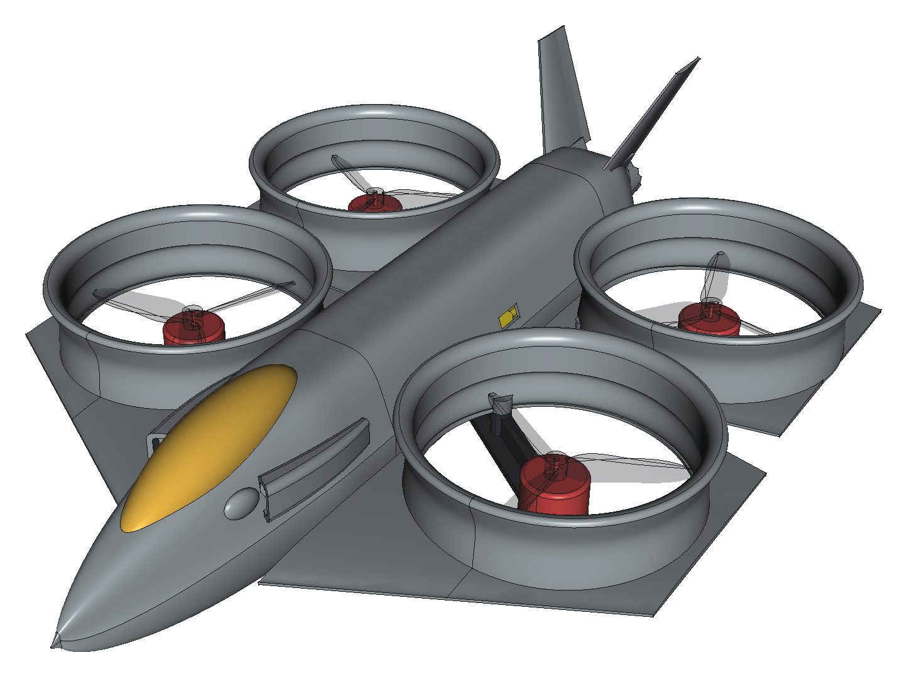
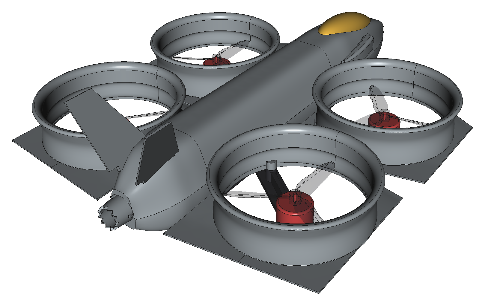
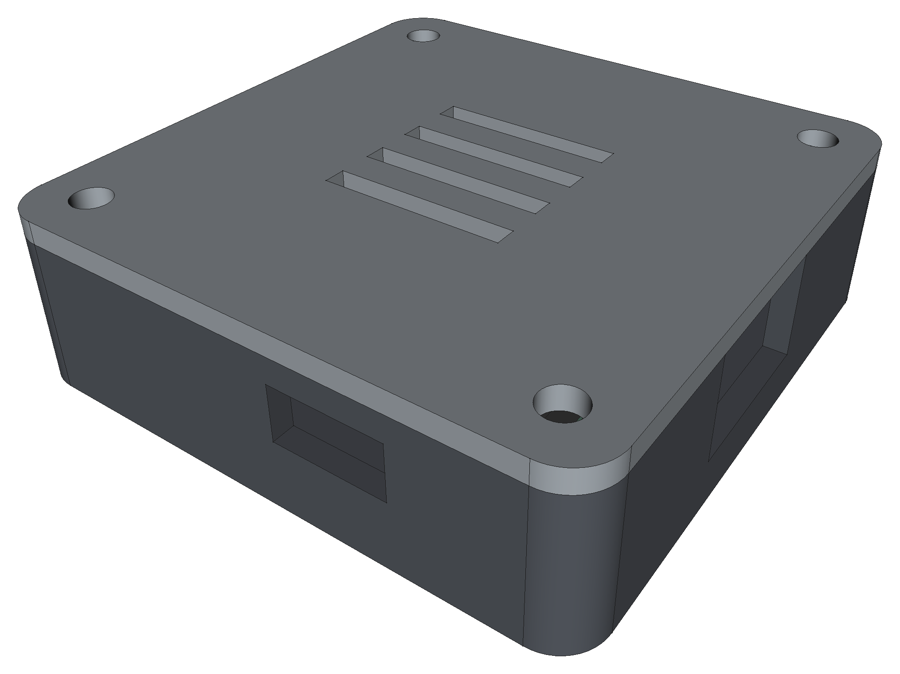
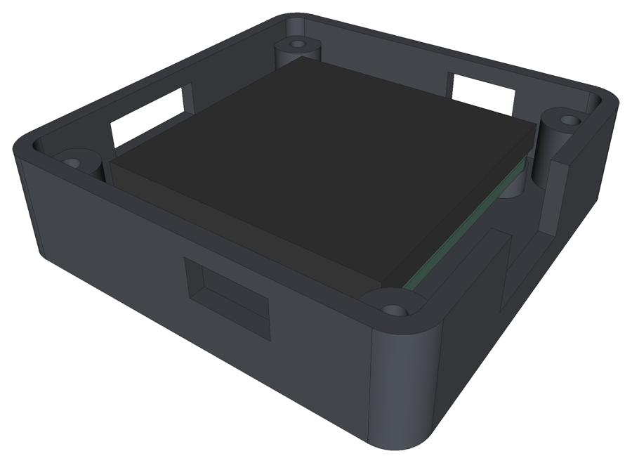
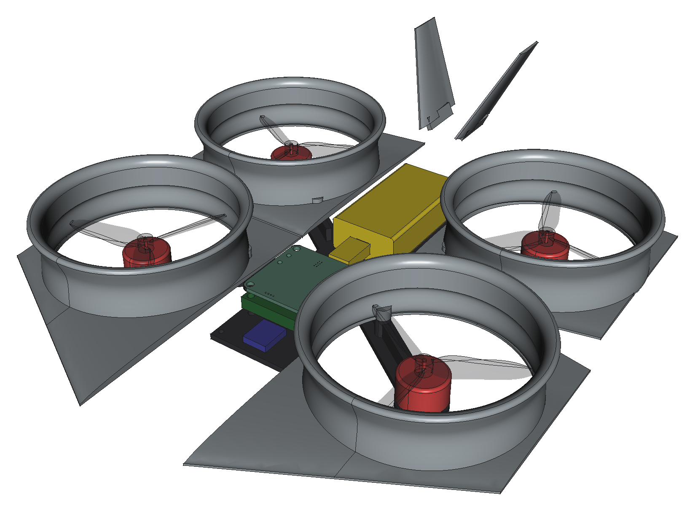

# RL CAD

RL CAD is an engineering assistant for mechanical design. A language model changes the design *specification*: the
requirements, the parts, the parameters and the printer. RL CAD then builds the geometry, checks it against
engineering rules and exports files that open in ordinary CAD tools. It is the mechanical counterpart of
[RL PCB](../rlpcb), which does the same job for circuit boards in KiCad. Together they are two parts of one project:
autonomous systems that help engineers design things.

The first design RL CAD covers is a small F-35-style quadcopter. It has four 3-inch props in printed ducts and a 3S
battery, and it flies on the F405 flight controller designed with RL PCB.



## What it does

| Step | What RL CAD does |
|---|---|
| Spec | Stores requirements, catalog parts (each entry states where its numbers come from), airframe parameters, printer and decisions in `rlcad.json`. |
| Geometry | Builds a parametric, parted airframe with build123d (OpenCascade), as described below. |
| Components | Places the motors, props, ESC, FC, receiver and battery. The FC can be the real KiCad board, exported to STEP by kicad-cli. The battery is positioned so the centre of gravity lands on the thrust centre. |
| Checks | Bed fit (orientation search), prop clearance (swept disc), interference (every pair), connector access (a plug can reach the FC's USB-C from outside), mass budget and CG, propulsion (thrust, T/W, hover current, flight time), arm stiffness and strength (T-section cantilever, first bending mode), solid integrity (one valid, meshable body per part), and a print audit of every STL as it will be sliced (closed mesh, wall thickness by ray casting, knife edges, overhangs that would need support, bed contact). |
| Export | STEP assembly with named, coloured parts; a STEP and a print-oriented STL for each part; the frame as DXF for carbon plate; BOM (CSV/Markdown); `design.json`; `report.md`; renders. |
| Integrations | MCP server (Claude Desktop, Claude Code, any MCP client), CLI, FreeCAD workbench with a live bridge, Onshape REST upload, RL PCB/KiCad boards through `mech.json` and `enclosure.json`. |

The airframe is made of these printed parts:

- a load-bearing PETG frame;
- four duct pods: each duct is a revolved nacelle (bell-mouth inlet, straight throat at the prop plane, a slight
  diffuser to the exit) carrying a wing or tailplane panel with a flat-bottomed airfoil section, its edges tangent to
  the duct;
- a three-piece fuselage lofted through spline sections with a sharp chine, joined by slip-fit collars, with raked
  intakes and diverterless bumps on the nose, a teardrop canopy (printed with the nose) and a boat-tail that closes
  onto a serrated nozzle;
- two canted fins.

The propellers in the model are bought parts, shown as simple three-blade props. The prop clearance check uses
their full swept disc.

### Ready to print

Every part is shaped to print on a Bambu A1 mini without supports, and the `print_audit` check verifies this on the
exported STL files:

- The duct pods stand on the duct exit, which ends in a flat land. The wing or tail panel's flat underside lies in the
  same plane, so each pod starts flat on the bed.
- The wing and fin sections have blunt edges: at least 0.8 mm at the leading edge and 0.9 mm at the trailing edge,
  which is two extrusion lines. A sharp edge would vanish in the slicer.
- The fins are plano-convex and print lying on their flat side.
- The fuselage pieces stand on their cut faces, so their walls are vertical.
  - The nose cavity closes in a steep dome under a solid tip.
  - The tail converges onto the nozzle, so its end wall is a short bridge.
  - Two of the screw bosses sit on 45° gussets.
  - Where the body tapers, the skin is thickened, so that it stays about 1 mm thick measured at right angles to
    the surface.
- The canopy is a hollow shell printed as part of the nose. For a second colour, change filament at its height or
  paint it.

`out/report.md` lists each part's orientation, size, supports (none) and whether it needs a brim.



The model never draws geometry itself. RL CAD also carries most of the design knowledge, so smaller models can use
it:

- Every problem the checks find comes with ready-made fixes.
- `try_fix` applies a fix and keeps it only if the design improves.
- `parts_compatible` and `design_checklist` guide part choice and show progress.

See "Scaffolding for smaller models" in `docs/ARCHITECTURE.md`.

The model never draws geometry itself. It proposes a change, RL CAD rebuilds the design and re-runs the checks, and
the findings tell the model what is still wrong. The same loop made RL PCB reliable with smaller models.

## Working with the engineer

The engineer sets how much the AI does, per part of the design:

- **teach:** it explains.
- **advise:** it guides; you edit.
- **propose:** it builds and checks each change on a copy, and you accept or reject it.
- **do:** it edits; every change is journalled and can be undone.

For example, the fuselage can be in "advise" while the pods are in "propose". Each result lists what the checks
verified and what they could not, such as nominal part data, strength beyond the cantilever check, or aerodynamics.
In FreeCAD, use **RL CAD → AI mode…**, **Proposals…**, **Undo last change** and **Review part (DFM)**. See
`docs/COPILOT.md`.

Other tools:

- **`kickoff` / `kickoff_apply`:** turn an idea into the questions, the manufacturing route for the quantity, the
  pitfalls and a design folder.
- **`review_part`:** reviews any part, including a STEP or STL made in FreeCAD or Onshape, for FDM printing or
  injection molding (draft, undercuts, wall uniformity), giving the reason behind each point.
- **`explain`:** what a check protects against, or what a parameter moves.
- **`feature_add`:** holes, bosses, pads, pockets and ribs on a generated part, kept in the spec so they survive a
  rebuild.
- **`interface_changes` / `integration_check`:** notices between the electronics and the mechanics; when a board
  revision moves a connector, the mechanical side is told what moved and which checks it affects.

### Enclosure family

`kind: "enclosure"` builds a printed box around any RL PCB/KiCad board from its `mech.json`:

- a base with standoffs on the board's mounting holes;
- a lid with a lip and screw columns;
- openings for the connectors that must be reachable.

The example is `examples/fc_enclosure`, a box for the drone's flight controller (51.5 × 51.5 × 15.4 mm, openings for
USB-C and three headers). When the board changes, rebuilding moves the openings and standoffs with it.

 

## Example: `examples/f35_ducted_quad`

| | |
|---|---|
| Parts | RL-FC F405 (RL PCB), Racerstar Shot30A 4-in-1 ESC, 4× iFlight XING2 1404 4600KV, Gemfan Hurricane 3016 tri-blade props, Tattu 3S 650 mAh 75C (XT30), RadioMaster RP1 ELRS receiver |
| All-up weight | ≈256 g (battery 59 g, printed parts ≈120 g) |
| Thrust-to-weight | 3.7 (estimate, no duct gain assumed) |
| Hover | ≈52 % throttle, ≈4.5 A, ≈6.9 min |
| CG | x 0.0, y 0.2 mm (battery placed by the CG solver) |
| Frame arms (PETG) | 0.28 mm tip deflection at full thrust, safety factor 14.7, first mode ≈142 Hz (warning; 3 mm carbon ≈221 Hz) |
| Printer | Bambu Lab A1 mini (180 mm bed): all 10 printed parts fit, none needs support |
| Checks | 0 errors; 2 warnings, both acknowledged with a recorded reason |

### The parts it is built around

The airframe is dimensioned from these parts' published data, not from generic sizes. Each catalog entry records its
source.

| Part | Data used | Where it shapes the design |
|---|---|---|
| iFlight XING2 1404 4600KV | φ19.9 × 13.5 mm body, 18.4 mm overall, 1.5 mm shaft, 9×9 mm M2 pattern, 9.1 g, 11.8 A continuous (17.99 A peak) | motor pads and holes; the arm ribs stop 1.5 mm short of the bell; prop height |
| Gemfan Hurricane 3016 tri-blade | 76.49 mm, 1.5 mm bore, 5.5 mm hub, 8.84 mm blade width, 1.2 g | duct bore (1.36 mm tip gap); prop plane at z 18.75 mm, the hub sitting on the bell |
| Tattu 3S 650 mAh 75C | 58 (±5) × 31 (±2) × 16 (±2) mm, 59 g, 45 mm 16 AWG lead, XT30 | battery bay, checked at the upper tolerance (63 × 33 × 18 mm); room for the XT30 ahead of the pack |
| Racerstar Shot30A | 36 × 36 mm, 30.5 mm M3, 10 g, 30 A continuous, 3–6S | stack height; power check (30 A per motor against the motor's rating) |
| RadioMaster RP1 V2 | 13 × 11 × 3 mm, 2.2 g, 65 mm antenna | receiver position ahead of the stack |

The assembly models the parts from the same data: the motor's base, bell and shaft; the prop's hub, bore and blades;
the battery with its lead and mated XT30.

Checks on the parts:

- `prop_fit`: the prop bore matches the motor shaft.
- `motor_fit`: the motor base sits on its pad.
- `battery_fit`: the largest pack within tolerance still fits.
- `power_esc`, `power_battery`, `power_connector`, `power_voltage`: the current and voltage ratings along the power
  chain.

The screw length for the motors comes out as M2×5: the 2.5 mm plate plus about 2.5 mm into the motor base. The
screws supplied with the motor are M2×7.



*The same model with the fuselage hidden: the RL PCB flight controller (its KiCad STEP), ESC, receiver and
battery on the frame. Rendered in FreeCAD with `rlcad showcase`.*

The checks found and fixed these faults while the design was being built:

- The ESC collided with the arm ribs.
- The frame arms passed through the fuselage walls. Slots were added.
- The fins overlapped the centre-shell collar.
- The canopy overlapped the fuselage.
- The arms were too flexible: 6 mm deflection at 97 Hz, now 0.3 mm at 125 Hz.
- Battery-strap slots and a lightening window cut two arms off the frame.
- The nozzle floated free of the tail.
- The fuselage screw bosses collided with the battery.
- The two motor hole patterns merged into slots.
- The FC's USB-C faced the front-left duct, so no plug could reach it. It is now brought out to the fuselage side with a short extension.
- After the smoother v2 body, the rear shell screw bosses reached into the battery bay. They now sit against the side wall.
- The print audit found problems that the geometry checks could not see:
  - Airfoil trailing edges that would not print. Across the four pods, about 1,300 mm² of surface was thinner than
    one extrusion line.
  - Wings floating above the bed. They needed about 3,700 mm² of support under each pod.
  - The nose exported tip-down.
  - Knife-thin skin at the nose tip.
  - A lofted skin that sagged to 0.7 mm between stations.
  - A wide flat end on the tail, which needed support.
  - Two meshes that were not closed.

  Each of these is fixed above.
- With the wings lowered, the USB-C plug path was blocked. The socket moved up, above the wing roots.

Each fault was found by a check, not by eye.

## PCB ↔ CAD

RL PCB and RL CAD meet through two JSON files kept in the board's KiCad project:

- `<board>.mech.json`, written by RL PCB, says what the board is.
- `enclosure.json`, written by RL CAD, says what space the product gives it.

`rlcad integrate <design>` checks both sides and the cables between boards; see `docs/INTEGRATION.md`.

## Electronics

`examples/f35_ducted_quad/electronics/` holds the PCB side of the drone:

- the flight controller's KiCad project, fully routed with 0 DRC errors, plus its Gerbers and JLCPCB BOM/CPL;
- interface models of the bought ESC and receiver;
- an RL PCB `system.json` that checks the cables between them.

Its README lists what to verify before you order.

## Install

```bash
python -m venv .venv
.venv/bin/pip install -e .            # Windows: .venv\Scripts\pip install -e .
```

On Windows, run `install_windows.ps1` instead. It creates the venv, installs RL CAD and prints the Claude Desktop MCP
config. RL CAD requires Python 3.10–3.13, and build123d installs the OpenCascade kernel as a wheel.

## Use

```bash
rlcad new designs/my_f35 --name my_f35          # new design (defaults: parts above, A1 mini)
rlcad fc designs/my_f35 path/to/board.kicad_pcb # use your real flight controller (needs KiCad)
rlcad check designs/my_f35                      # build + checks
rlcad set designs/my_f35 tip_gap=1.2 duct_depth=28
rlcad export designs/my_f35                     # files into designs/my_f35/out
rlcad render designs/my_f35 --what inside     # quick preview (matplotlib)
rlcad showcase designs/my_f35                   # presentation renders through FreeCAD (after export)
rlcad onshape designs/my_f35                    # after setting ONSHAPE_ACCESS_KEY / ONSHAPE_SECRET_KEY
rlcad tools                                     # list the agent tools
```

To connect RL CAD to Claude Desktop, add this to `claude_desktop_config.json`:

```json
{"mcpServers": {"rlcad": {"command": "C:\\path\\to\\rlcad\\.venv\\Scripts\\python.exe",
                          "args": ["-m", "rlcad.agent.mcp_server"],
                          "env": {"RLCAD_PROJECT": "C:\\path\\to\\designs\\my_f35"}}}}
```

## Where the files go

- **Onshape:** use `rlcad onshape`, or import `out/assembly.step` by hand (Onshape → Import). The parts arrive
  separately, named and coloured.
- **FreeCAD:** use the RL CAD workbench, which `install_windows.ps1` installs. Re-run the installer after updating: the workbench
  commands now live in `rlcad_freecad/commands.py`, which fixes a start-up error (`_OpenDesign` not defined) in the
  older `InitGui.py`. **Open design...** shows the model
  together with a parameter sheet and the check results. Edit a value, then press **Sync**. Claude can drive the
  same window through the local bridge (`freecad_*` tools).
- **Fusion 360, SolidWorks:** open `out/assembly.step` or `out/parts/*.step`.
- **Slicer (Bambu Studio, PrusaSlicer):** use `out/print/*.stl`. Each part is already laid out in its print
  orientation. The duct pods need supports under the wing plate.
- **Carbon frame:** send `out/frame.dxf` to a CNC or waterjet service (3 mm plate).

## Limits

- Propulsion uses typical static prop coefficients. Thrust-stand data for the exact motor and prop replaces them.
- The duct thrust gain is not counted.
- Arm checks treat each arm as a cantilever. There is no FEA yet.
- Aerodynamics of the body are not modelled. This is a multirotor, so the wings are cosmetic.
- The molding review checks draft, undercuts and wall uniformity. It does not simulate mold flow, gates or cooling.
- The enclosure family builds a screwed two-part box. Snap fits, gaskets and IP sealing are not modelled.
- One airframe family so far (`ducted_quad_f35`). The spec, checks, exports and tools are generic. New families add a
  geometry module.
- The Onshape adapter follows the documented v10 API but has not yet been run against a live account.

See `docs/ARCHITECTURE.md` for how RL CAD is built and how it relates to RL PCB.
